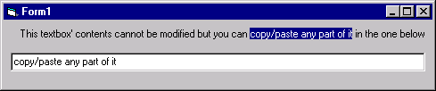

<div align="center">

## Copybox/Copylabel


</div>

### Description

This snippet creates an uneditable textbox/label whose contents can be copied to the clipboard.

This is just like the textboxes in the File properties of Windows (open Windows Explorer, right-click on a file and select PROPERTIES,

you'll see that several fields here can be copy/pasted although they cannot be modified).

Straightforward and commented code.
 
### More Info
 
This is very basic code, very easy to understand.


<span>             |<span>
---                |---
**Submitted On**   |
**By**             |[tilleul](https://github.com/Planet-Source-Code/PSCIndex/blob/master/ByAuthor/tilleul.md)
**Level**          |Beginner
**User Rating**    |4.3 (13 globes from 3 users)
**Compatibility**  |VB 3\.0, VB 4\.0 \(16\-bit\), VB 4\.0 \(32\-bit\), VB 5\.0, VB 6\.0
**Category**       |[Custom Controls/ Forms/  Menus](https://github.com/Planet-Source-Code/PSCIndex/blob/master/ByCategory/custom-controls-forms-menus__1-4.md)
**World**          |[Visual Basic](https://github.com/Planet-Source-Code/PSCIndex/blob/master/ByWorld/visual-basic.md)
**Archive File**   |[](https://github.com/Planet-Source-Code/tilleul-copybox-copylabel__1-30686/archive/master.zip)


### Source Code

```
' ##################################################################
' CopyBox/CopyLabel: (c) 2002 Tilleul
' =======
' This snippet creates an uneditable textbox/label whose contents can
' be copied to the clipboard.
' This is just like the textboxes in the File properties of Windows
' (open Windows Explorer, right-click on a file and select PROPERTIES,
' you'll see that several fields here can be copy/pasted although they
' cannot be modified).
'
' Usage:
' 1- open a new VB project
' 2- on form1, draw a textbox (name=text1)
' 3- on form1, draw a second textbox (name doesn't matter)
' 4- copy/paste the code
' ##################################################################
Private Sub Form_Load()
' some text to test the snippet
Text1.Text = "This textbox' contents cannot be modified but you can copy/paste any part of it in the one below"
' no border
Text1.BorderStyle = 0
' flat (not 3D)
Text1.Appearance = 0
' backcolor is the same as your windows default backcolor
Text1.BackColor = vbButtonFace
End Sub
Private Sub Text1_Keydown(KeyCode As Integer, Shift As Integer)
If (Shift = vbCtrlMask And (KeyCode = vbKeyInsert Or KeyCode = vbKeyC)) And _
    (Text1.SelLength <> 0) Then
    ' if user presses CTRL-C or CTRL-INS (Windows keyboard shortcuts to copy to clipboard)
    ' and if there is selected text, then copy this text
    Clipboard.SetText Text1.SelText
ElseIf KeyCode <> vbKeyLeft And KeyCode <> vbKeyRight And KeyCode <> vbKeyUp And KeyCode <> vbKeyDown Then
  ' if not an arrow key then cancel
  KeyCode = 0
End If
End Sub
Private Sub Text1_KeyPress(KeyAscii As Integer)
' whatever key is pressed, cancel it
KeyAscii = 0
End Sub
```

